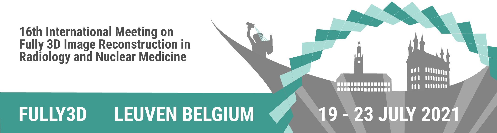

# Templates for submissions to the Fully3D 2021

Recommended templates for submissions to the 16th International Meeting on
Fully 3D Image Reconstruction in Radiology and Nuclear Medicine, 19 - 23 July 2021, Leuven, Belgium.

We strongly encourage the use of the latex template (fully3d_template.tex), but also
provide a Word template (fully3d_template.docx).

fully_3d_template.pdf is a rendered preview generated from the latex template.

**Submission rules**
- Submission only in pdf format
- two column format
- font size 11 for main text, abstract and references can use font size 9
- Maximum 4 A4 pages including everything (strict limit)
- In addition: prepare short abstract (max 150 words) to be entered in online submission system! This will only be used for the program. It will **not** be used for the review process **nor** for the final proceedings.

[Link to online submission system](https://www.conftool.pro/fully3d-2021/index.php?page=index)

## How to build the LaTex template

You can manually build the latex template by executing
```
pdflatex fully3d_template.tex
bibtex   fully3d_template.aux
pdflatex fully3d_template.tex
pdflatex fully3d_template.tex
```

Alternatively, simply run the build chain including pdflatex and bibtex of your favorite LaTex editor or use [latexmk](https://mg.readthedocs.io/latexmk.html).
